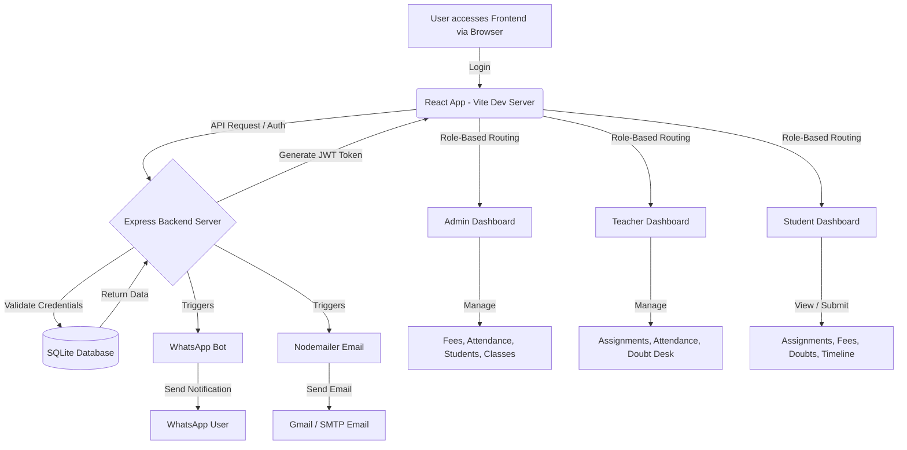

# Aarambh - School Management System

Aarambh is a comprehensive, multi-role School Management System designed to streamline administrative tasks, enhance teacher-student communication, and provide a unified platform for managing school operations.

## 🚀 Features

- **Multi-Role Dashboards**: Dedicated interfaces for Admins, Teachers, and Students.
- **Attendance Management**: Track and monitor student attendance.
- **Fee Management**: Manage and track fee payments and dues. Automatically filters and starts ledgers from the month the student joined.
- **Assignments**: Teachers can upload worksheets and grade submissions; students can upload links/files, submit them, and delete/resubmit ungraded work.
- **Academic Doubt Desk**: Students can submit doubts directly; teachers can review pending academic doubts and reply inline.
- **Library System**: Manage school library resources and revision material.
- **Calendar & Events**: School-wide calendar for events and holidays.
- **Real-time Notifications**: Integrated with WhatsApp Web JS for automated WhatsApp notifications.
- **Email Integration**: Ethereal & secure Gmail SMTP server configuration for notifications.
- **File Uploads**: Secure file uploads using Multer.
- **Authentication & Security**: JWT-based authentication, Bcrypt password hashing, and active database password updates.
- **Dynamic Personalization**: Day-of Class Timeline status countdowns and live graded performance charts.

## 🛠️ Technology Stack

**Frontend:**
- **React.js** (v19)
- **Vite** (Build Tool)
- **React Router DOM** (Routing)
- **Recharts** (Data Visualization)
- **jsPDF & jsPDF-AutoTable** (PDF Report Generation)
- **Lucide React** (Icons)

**Backend:**
- **Node.js & Express.js**
- **SQLite3** (Database)
- **jsonwebtoken (JWT)** (Authentication)
- **bcrypt** (Password Hashing)
- **whatsapp-web.js** (WhatsApp Bot Integration)
- **multer** (File Uploads)
- **nodemailer** (Email Services)

## ⚙️ Prerequisites

Before you begin, ensure you have met the following requirements:
- **Node.js** (v16 or higher)
- **npm** (Node Package Manager)
- Google Chrome (Required for WhatsApp Bot Puppeteer)

## 💻 Installation & Setup

1. **Clone the repository** (if not already done):
   ```bash
   git clone https://github.com/Hussain-45/Aarambh-Education.git
   cd Aarambh-Education
   ```

2. **Install Frontend Dependencies:**
   In the root directory, run:
   ```bash
   npm install
   ```

3. **Install Backend Dependencies:**
   Navigate to the `server` directory and install packages:
   ```bash
   cd server
   npm install
   ```

4. **Environment Variables:**
   Create a `.env` file in the `server` directory. Example:
   ```env
   SECRET_KEY=your_secret_jwt_key
   PORT=5000
   ```

## ▶️ Execution Flow

### Starting the Backend Server
The backend server handles API requests, database interactions, and the WhatsApp robot.
1. Open a terminal and navigate to the `server` directory:
   ```bash
   cd server
   ```
2. Start the server:
   ```bash
   node server.js
   ```
   *Note: On first run, it will initialize the SQLite database and generate a QR code in the console. Scan this QR code with your WhatsApp app (Linked Devices) to activate the WhatsApp robot.*

### Starting the Frontend Client
1. Open a new terminal and navigate to the project root directory.
2. Start the Vite development server:
   ```bash
   npm run dev
   ```
3. Open your browser and navigate to the URL provided by Vite (usually `http://localhost:5173`).

---

## 📱 Compiling to a Mobile App (APK)

Aarambh can be compiled into a real mobile app (APK) using **Capacitor** for free local distribution:

1. **Install Capacitor CLI & Android Platform**:
   ```bash
   npm install @capacitor/core @capacitor/cli
   npx cap init Aarambh AarambhApp --web-dir=dist
   npm install @capacitor/android
   npx cap add android
   ```
2. **Build the Web App**:
   ```bash
   npm run build
   npx cap sync
   ```
3. **Generate APK**:
   * Open the project in Android Studio: `npx cap open android`.
   * Go to **Build** ➔ **Build Bundle(s) / APK(s)** ➔ **Build APK(s)**.

---

## 📊 Working & Execution Flowchart



## 📝 Available Commands

### Frontend (Root Directory)
- `npm run dev`: Starts the Vite development server.
- `npm run build`: Builds the app for production to the `dist` folder.
- `npm run lint`: Runs Oxlint to catch code quality issues.
- `npm run preview`: Locally preview the production build.

### Backend (`server` Directory)
- `node server.js`: Starts the Express server and initializes the WhatsApp client.
- `node migrate.js`: Run database migration scripts (if needed).
